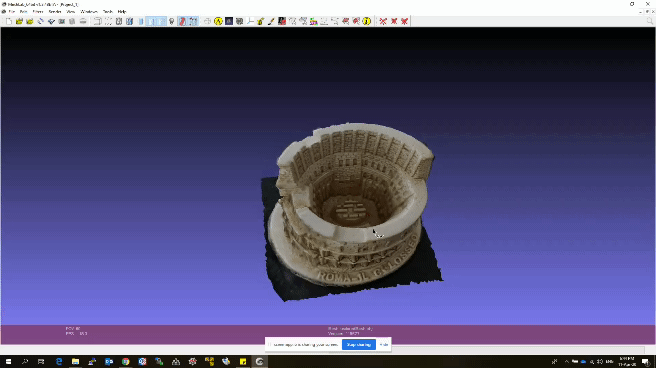

# 3D-Reconstruction
Use Python in Google Colab to generate 3D reconstruction of objects. 
Meshroom software package from AliceVision is used with python to perform 3D reconstruction.

## Prerequisites
You need a Google Colab account

## Workflow
1. Make pictures of the target object from multiple angles. Try to cover 360° of the object with different pictures.
2. Move the pictures in to the 'input folder' of Google Drive. You can also directly upload from your smart phone.
3. Open the .ipynb file in your Google Colab and edit the paths to the input and output folders in Google Drive.
4. In your Google Colab 'menu bar', go to 'Runtime'-->'Change runtime type'
5. Select Runtime type as python3 and Hardware accelerator as GPU. Save the settings.
6. Run the code in Google Colab. You may be asked to authenticate, follow the steps requested by Google.
7. Meshroom will perform 3D reconstruction and the output files will be moved to the output folder in Google Drive.
8. You can download the 3 output files and load the '.obj' file using MeshLab in your PC or using Emb3D in your Android smart phone.
